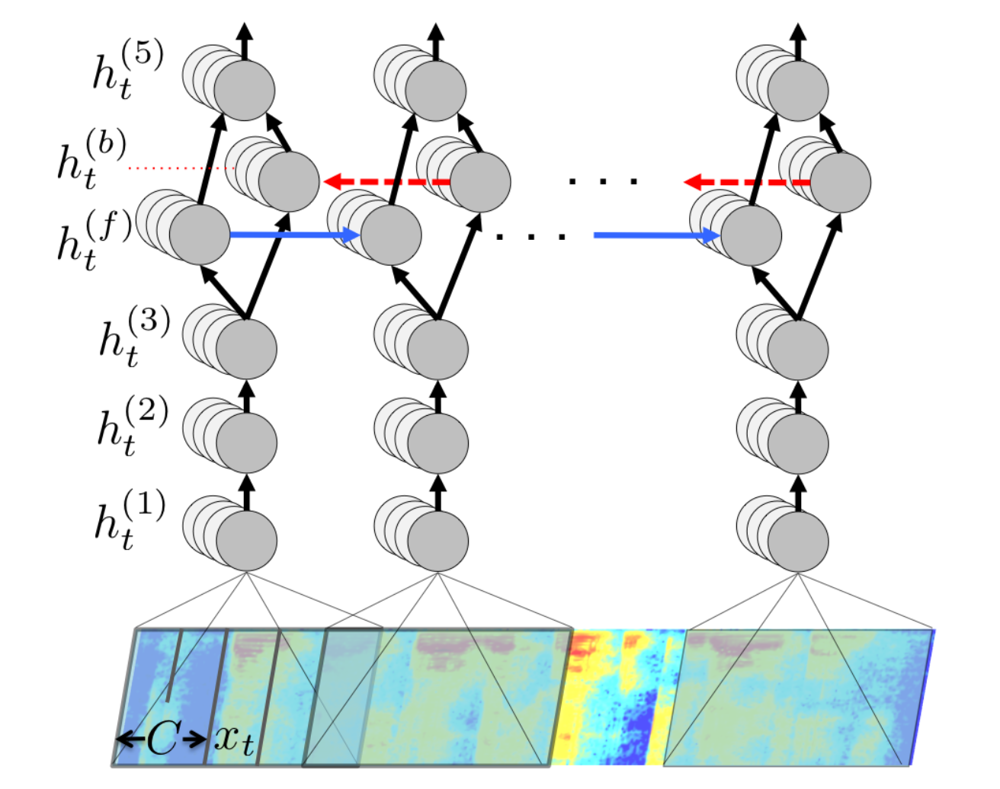

# Project DeepSpeech for Korean
```
1. 한국어 음성 인식 모델
```

```
2. 발음 기호 생성 모델
```

## Prerequisites

* [Python 2.7](https://www.python.org/)
* [Git Large File Storage](https://git-lfs.github.com/)

* CUDA 8.0
* Tensorflow GPU 1.4.0

## Model Architecture



## Training Enviroment

```
10.100.1.111 학습 환경 구축

/data3/dongk/DeepSpeech/
```

## Getting the code

```bash
git clone http://10.100.1.154/Kimdongyup/DeepSpeech.git
```

#### Create a DeepSpeech virtual environment

```
$ virtualenv --python=python2.7 env
```

#### Activating the environment

```
$ source env/bin/activate
```

#### Installing DeepSpeech Python bindings

```
***** pip 업로드 필요
$ pip install --upgrade pip

$ pip install -r requirements.txt
```

## DataSet

1. 한글
```
    Korean Single Speaker Dataset   12.8 h
    손석희 news Dataset             7.1 h
    ytn News Dataset                13.1 h
    Zeroth Korean Dataset           93.8 h
    Korean Voice Dataset            18.0 h
    Seoul Voice Dataset             145.3 h
    ETRI Open AI Dataset            69.5 h
    Youtube Crawling Dataset        150.0 h

    총 약 500 시간
```

2. 영어
```
    Common Voice Dataset v1         400 h

    총 약 400 시간
```    

### 추가 확보 가능한 Dataset
```
1. 한글
    AI 오픈 허브 (http://www.aihub.or.kr/content/552) 약 1000시간
2. 영어
    Common Voice v2 (https://voice.mozilla.org/ko/datasets) 약 1000시간
```

## Training

### Training Parameter
```
Input : 26-dim MFCC
Output : 인식 결과 text
```

**mfcc 란?** http://blog.naver.com/PostView.nhn?blogId=mylogic&logNo=220988857132&categoryNo=22&parentCategoryNo=0&viewDate=&currentPage=1&postListTopCurrentPage=1&from=postView

```
- 5 Bi-LSTM layers
- 2048 hidden states
```

### Training a model
#### Running code
한글 모델
```
$ python DeepSpeech.py
```
영어 모델
```
$ python DeepSpeech_ENG.py
```

#### Parameters
```
    - checkpoint_dir    checkpoint directory path
    - train_files       train files list csv file path
    - dev_files         developments files list csv file path
    - test_files        test files list csv file path
    - train_batch_size  train batch size
    - dev_batch_size    dev batch size
    - test_batch_size   test batch size
    - epoch             훈련 epoch 수
    - dropout_rate      dropdout 값
    - learning_rate     훈련 learning rate
    - validation step   dev 평가 epoch step 수
    
    - 그외 : DeepSpeech.py의 line 35 ~ 163 참고
```

#### 학습 data path
```
Server : 10.100.1.111

※ 학습 시 데이터는 data/ 폴더에 위치시켜야 함 (csv  file에 정의된 path와 일치)
```

한국어 데이터
```
    /data3/dongk/DeepSpeech/data/
    1. kss (Korean Single Speaker Dataset)
    2. son (손석희 news Dataset)
    3. CV (ytn News Dataset)
    4. zeroth_korean (Zeroth Korean Dataset)
    5. Korean_Voice_DB (Korean Voice Dataset)
    6. SeoulVoiceDB (Seoul Voice Dataset)
    7. ETRI (ETRI Open AI Dataset)
    8. youtube (Youtube Crawling Dataset)
```
영어 데이터
```
    /data3/dongk/DeepSpeech/data/ENG/clips
```

#### example 
```
$ python -u DeepSpeech.py --checkpoint_dir ../chk --train_files data/ENG/train.csv --dev_files data/ENG/dev.csv --test_files data/ENG/test.csv --train_batch_size 16 --dev_batch_size 8 --test_batch_size 8 --epoch 20 --dropout_rate 0.5 --learning_rate 0.0001 --validiation_step 5
```

#### 학습된 checkpoint
한글 모델

```
data/model/chk_kor
```
영어 모델

```
data/model/chk_ENG
```

## Inference
한글 모델
```
$ python -u DeepSpeech.py --one_shot_infer <wav file path> --checkpoint_dir <checkpoint directory path>
```
영어 모델
```
$ python -u DeepSpeech_ENG.py --one_shot_infer <wav file path> --checkpoint_dir <checkpoint directory path>
```

### source code
```
DeepSpeech.py 파일의 do_single_file_inference 함수 참고

output : CTC 처리까지 끝낸 최종 text array

logit : CTC 전 RNN의 결과 vector

logit을 이용하여 각 frame의 character별 추정치를 확인 가능
```
### Inference 결과

```
파일 재생 시간(초) : [  ]

총 frame 수 : [ ]

------------------------------------------
frame   rank1	rank2	rank3
------------------------------------------
0   	  * 	  ㅎ	   ㅌ
1   	  ㅎ      ㅂ	    *
2   	  ㅎ      *       ㅂ
3   	  * 	  ㅎ      ㅂ
4   	  ㅏ	   * 	   ㅓ
5   	  ㅏ	   * 	   ㅓ
6   	  *	   	  ㄴ
7   	  *	   	  ㄴ
8   	  *	   	  ㄴ
9         *       ㄴ
10  	  ㄴ      ㄷ      *
11  	  * 	  ㅏ	   ㄴ
12  	  ㅏ      *       ㅘ
13  	  *       ㅁ	   ㅇ
14  	  * 	  ㅁ	   ㅂ
15  	  * 	  ㅁ	   ㅂ
...
------------------------------------------
duration : **:**:**
------------------------------------------
인식 결과 :  [  ]
```

### test file path
한국 음성 데이터
```
    Zeroth test dataset

    data/test/kor
    reference text : data/test/kor/zeroth_test.csv
```

영어 음성 데이터
```
    LibriSpeech test-clean dataset

    data/test/eng
    reference text : data/test/eng/librispeech_test.csv
```

## Reference

1. **Paper** https://arxiv.org/abs/1412.5567

2. **Github** https://github.com/mozilla/DeepSpeech/